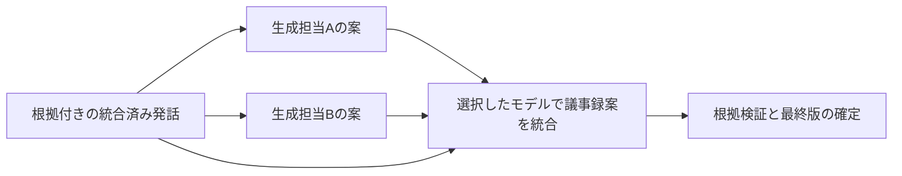

# プロバイダ・モデル設定と議事録生成方式の設計

作成: 2026-08-28。最終確認: 2026-08-29。全体設計であり、全項目が実装済みという意味ではない。
PR 1 の接続管理・認証・モデル一覧は実装・fake 統合検証済み。工程別モデル適用以降は未実装。
PR 1 は製品 0.2.0、契約 2.0.0 とし、対応した機能だけを capabilities に公開する。
機能単位で配布し、インストール済みアプリの更新で確認する。公開済み旧版の配布物と既存会議データは変更しない。Notion 正本への反映は未実施。

関連: [契約案](2026-08-28-provider-workflow-contracts.md)、
[実行・保存設計](2026-08-28-provider-workflow-execution.md)、
[実装計画](../plans/2026-08-28-provider-workflow.md)。

## 1. 目的と現状の不足

narumi.app だけで、接続の準備から工程別のモデル選択、生成、結果確認まで完結させる。
アプリで確定した設定と同じ設定を MCP・製品 CLI でも読み書きできるようにする。
単一プロバイダを選べることだけを「プロバイダ設定が完成した」と扱わない。

0.1.4 の実装を確認した結果:

| 対象 | 現状 | 必要な変更 |
|---|---|---|
| 会議・プロファイルの設定 | エンジン名・LLM 名をそれぞれ一つ選ぶ | 工程ごとの接続・モデル・対応パラメータ |
| 公開 `meeting_config` | モデル指定がない | 型付きの処理設定と実効設定の返却 |
| 認証 | LLM 用の接続・認証画面がない | 安全な保存、認証状態、接続確認 |
| Codex / OpenAI 音声認識 | アダプタ未実装 | 接続から結果保存までの実装 |
| LLM 工程 | 一つの `llm_provider` を共用 | 工程別の選択、複数の生成担当と最終統合担当 |
| LLM キャッシュ | モデル・推論設定を識別しない | 実効モデルを含む指紋と部分再実行 |
| パリティ検査 | 主にツール名集合の一致 | 設定・保存・再読込・実行までの往復テスト |

根拠は `SettingsTabView.swift`、`ProfilesSheetView.swift`、
`contracts/defs/common.json` の `meeting_config`、`narumi.models.MeetingConfig`、
`narumi.llm.registry`、`narumi.generate.cache`。

## 2. 対応範囲

### LLM の接続

| 接続種別 | 初期の認証・準備 | 用途・注意 |
|---|---|---|
| `codex-app-server` | narumi 専用の公式 ChatGPT ログイン | モデル・推論設定を取得して利用。利用枠は無限でも無条件に無料でもない |
| `claude-agent-sdk` | 明示的な Anthropic API キー | SDK の実装経路。通常は API 課金として判定する |
| `openai-api` | OpenAI API キー | Responses API による文章・画像入力、音声認識の接続も共用可能 |
| `anthropic-api` | Anthropic API キー | Messages API による生成 |
| `ollama` | 同じ Mac 上の接続先とローカルモデル | loopback だけでローカル推論とは判定しない。クラウドモデルは初期対象外 |

同じ種別で複数の接続を登録できる。接続には安定した ID と表示名を持たせる。
Codex の API キー利用は初期対象ではなく、OpenAI API 接続として分ける。
Claude SDK と Anthropic API は同じベンダーでも、能力・実行方法の異なる接続として表示する。

**Claude SDK のサブスク認証を提供できるとは前提にしない。**
公式 Quickstart は、事前承認のない第三者製品による claude.ai ログイン・利用枠の提供に
制約を記載している。narumi は API キー方式を設計し、承認を確認できるまでは
サブスク接続を選択不可にする。既存の `subscription` 固定宣言は実装時に修正する。
出典: [Claude Agent SDK Quickstart](https://code.claude.com/docs/en/agent-sdk/quickstart)。

### 音声認識・話者分離

- ローカルの mlx-whisper / faster-whisper を維持し、モデルを明示選択できるようにする。
- OpenAI 音声認識を追加する。初期対応は時刻付き応答を扱える `whisper-1` と
  `gpt-4o-transcribe-diarize`。モデル一覧に存在することと、工程で使えることは区別する。
- `gpt-transcribe`、`gpt-4o-transcribe`、`gpt-4o-mini-transcribe` などの時刻なし経路は、
  本文を既存の時刻付き発話へ変換できる工程ができるまで、理由付きで選択不可にする。
- pyannote と話者分離なしを維持する。モデルの利用条件・追加依存・認証が必要なら画面に表示する。
- マイクとシステム音声は引き続き別トラック。API 利用も別入力・別の処理記録とする。

OpenAI のモデル・応答形式・長さ制限の根拠と、時刻なし経路を分ける理由は
[実行・保存設計](2026-08-28-provider-workflow-execution.md)に記載する。

### 今回の機能実装計画に含めないもの

任意の OpenAI 互換サーバー、Bedrock / Vertex / Foundry、外部 Ollama、
LLM による自由なツール操作、コンテキスト取得 v2、リアルタイム文字起こし、
Notion 画像アップロードは別途設計する。拡張点は残すが利用可能とは表示しない。

## 3. アプリの画面と操作

既存の会議設定とプロファイル編集で、一つの処理設定エディタを共有する。
「発話の統合」と「議事録案の統合」は別の工程名として表示する。

| 入口 | 何をするか | なぜ必要か | 入力・空欄の扱い |
|---|---|---|---|
| 全体設定 → プロバイダ接続 | 追加・準備・認証・確認・無効化・削除 | 秘密と会議設定を分離する | 種別と表示名を選ぶ。公式 API の送信先は変更不可 |
| 接続詳細 | 認証状態と対応モデルを確認 | 設定保存を認証成功と誤認しない | API キーは新規時に入力。編集時の空欄は維持、削除は別操作 |
| プロファイル → 処理設定 | 新規会議の既定を設定 | 同じ構成を再利用する | 各工程で接続・モデルを選択。任意工程は明示的に「使わない」 |
| 会議 → 設定 | その会議の設定を変更 | 既存会議へ意図せず波及させない | 適用元と差分を表示。保存しても自動再生成しない |
| 録画開始 / 取り込み | プロファイルと処理方法を選ぶ | 開始前に動作を把握する | プロファイル名の自由入力を選択式に統一。scope 等は従来どおり省略可 |
| 再生成前の確認 | 再利用・再処理・送信・利用枠を確認 | 設定変更の影響を把握する | サーバーの計画を表示。古い確認を使い回さない |
| ジョブ詳細 | 工程・生成担当ごとの進捗、失敗、取消 | 一部の失敗で成果を失わない | 再照会と再実行を別操作にする |
| 議事録 → 生成履歴 | 最終版と各案を比較 | 採用内容と根拠を確認する | 比較は閲覧だけ。標準のエクスポートは完成した最終版 |

接続画面は「ランタイム未準備」「資格情報未設定」「認証未確認」「認証必要」
「モデル一覧取得済み」「生成の最終結果」を区別する。
接続テストはモデル一覧などのメタデータ通信だけとし、会議や試験プロンプトを送らない。
一覧取得成功だけで、そのモデルの生成権限・利用枠・品質を保証しない。

モデル欄は接続先の候補から選ぶ。候補の取得日時、能力、利用不可理由を表示し、更新操作を設ける。
既存選択が一覧から消えても黙って別モデルへ変更しない。未確認・廃止・接続不能を表示する。
推論設定はモデルが対応する値だけを表示し、未対応の設定は保存・実行とも拒否する。
温度、推論強度、thinking budget、出力上限は、全モデルに一律で適用しない。

API キーは再表示しない。保存成功・失敗・閉じる際に入力を消去する。
接続の無効化と資格情報の削除を区別し、SDK の認証はログアウトの影響を説明する。
認証ダイアログは閉じても自動再送せず、同じ認証操作 ID の状態を照会する。

## 4. 工程別設定と生成方式

| 工程 | 選択するもの | 既定・制約 |
|---|---|---|
| 音声の前処理 | 固定処理の設定 | ffmpeg。LLM の選択欄を置かない |
| 文字起こし | エンジン / 接続・モデル・言語 | ローカル Whisper を維持。モデルを実効設定に固定 |
| 音声の話者分離 | なし / エンジン・モデル | なしを維持。トラック由来の分離は常に残す |
| 画面の話者判定 | なし / 接続・Vision モデル | なしを維持。画像対応と画像送信許可が必要 |
| 決定的アライメント | 固定アルゴリズム | LLM の選択欄を置かない |
| 発話の LLM 統合 | なし / 接続・モデル | 従来の単一系統素通し条件を維持 |
| 議事録生成 | 文字起こしベース / 単独 / 複数生成後に統合 | ローカル完結の既定を維持。要約なしはその旨を表示 |
| 議事録案の統合 | 接続・モデル | 複数生成時だけ必須 |

単独生成は生成担当を一つ選ぶ。複数生成は二つ以上を選び、最終統合担当も独立に選ぶ。
同じプロバイダの異なるモデルを組み合わせてもよい。表示名と別に安定した担当 ID を持つ。
初期の上限は生成担当 4 件、並列実行 2 件。上限の緩和は利用量と取消の検証後に行う。

各担当には同じ版の発話・会議ブリーフ・必要なスライドを渡す。
各案は独立生成し、最終統合へは案だけでなく根拠の原文も渡す。
多数決で事実を決めず、矛盾・担当者や期限の不一致・根拠不足は確認事項として残す。
複数生成は品質を保証せず、比較と統合を選べる機能として扱う。

## 5. プロファイル・会議・実効設定

設定は次の三つを混同しない。

| 種別 | 保存する内容 | 保存しない内容 |
|---|---|---|
| 接続 | 種別・表示名・接続先・認証方式・状態・版 | 会議本文 |
| プロファイル / 会議の選択 | 工程、接続 ID、モデル ID、パラメータ、送信許可、上限 | API キー、認証トークン、任意 HTTP ヘッダー |
| 実行の実効設定 | 入力版、解決済みモデルと能力、送信先、適用パラメータ、実装版 | 秘密、他の会議の内容 |

プロファイルは版を持つ。新規会議作成時に内容と版をコピーし、その後の編集を自動反映しない。
会議への別プロファイル適用・上書き解除は、差分確認後に明示保存する。
会議は適用元の不変スナップショットも保持し、元の設定を公開 API から取得できるようにする。
同時編集は期待する設定版で検出し、後勝ちで上書きしない。

新しい設定ではモデルを環境変数で暗黙に変更しない。
旧設定の移行候補は画面で確認させる。過去の議事録のモデルが不明なら、不明のまま保存する。
現在の環境変数やプロバイダの既定値を、過去の実行事実として書き込まない。

固定 ID・ローカルモデルの digest が取得できればそれを記録する。
alias の背後の実体が公開されない場合は、その限界と明示更新用の設定世代を記録する。
設定画面の「モデルの実体を更新して再実行」は確認を経て世代を進める。
非公開のモデル更新を自動で検知できるとは約束しない。

## 6. 認証・ランタイム・送信制御

API キーは macOS Keychain を使う `SecretStore` に保存する。
Python サーバーから呼ぶ同梱の小さなネイティブヘルパーで実装し、CLI に秘密を渡す引数を作らない。
Keychain を使えない場合は失敗とし、平文ファイルへ自動移行しない。
テストは fake の `SecretStore`、実 Keychain は専用テスト項目の opt-in 検証とする。
製品 CLI も秘密を通常のコマンド引数や `--json` の文字列に含めず、非表示入力か stdin を使う。

v2 の常駐接続はユーザー単位で認証する。loopback・Host・Origin だけで安全とはみなさない。
アプリと CLI は所有者限定の bootstrap 情報から TLS の証明書 pin を取得してサーバーを検証し、
Keychain に保存したインスタンス用 client token で認証する。秘密を送る前に両方を成立させる。
未認証の HTTP 応答で pin を更新しない。`server_instance_id` は認証の証明には使わない。
別 OS ユーザーと偽サーバーを対象とし、同じ OS ユーザー権限の侵害や root は保証範囲外とする。
他の MCP クライアントも同じ認証を使うか、所有ユーザーの stdio ブリッジ経由で接続する。
詳細と旧 HTTP 経路の扱いは [契約案](2026-08-28-provider-workflow-contracts.md)に従う。

Codex の認証・セッション状態は narumi が所有する専用 runtime に置く。
ユーザーの既存 Codex / Claude の設定、MCP、プラグイン、履歴、認証ファイルをコピーしない。
公式のログイン手順を使い、トークンを手動抽出する方式は採らない。
SDK が保持する認証情報はその正式な保存機構と寿命に従い、会議バンドルや宣言的設定へ戻さない。
初期実装は接続ごとに資格情報・認証セッション・SDK 状態を分離する。
ログアウトで別の narumi 接続を解除せず、接続間の認証共有や一括解除は提供しない。

Codex 実行ファイルなどの準備は既存の同梱 runtime 方式を拡張する。
版・hash・配布元・ライセンスを固定し、アプリで準備状態を表示する。
ユーザーに Terminal でのインストールを要求せず、新しいグローバル導入経路も増やさない。
準備・更新中には旧 runtime を実行ジョブから置き換えない。
準備とモデル取得も `prepare_provider_runtime` と job 追跡を使い、UI 専用の導入経路を作らない。

モデル候補は、プロバイダが申告する能力とアダプタで実証した能力の共通部分だけを有効にする。
Codex の `model/list` はモデル・入力種別・推論設定の取得に利用できる。
出典: [Codex App Server](https://learn.chatgpt.com/docs/app-server#models)。
OpenAI の Models 一覧だけから、各 ID の対応エンドポイントや時刻形式を推測しない。
公式のモデル情報を版管理した能力表と合わせ、未確認のモデルは理由付きで無効化する。

Claude Python SDK のモデル一覧取得は、導入する版で初期化応答を検証する。
TypeScript SDK のメソッドを Python にあると仮定しない。
同じ明示 API キーの Anthropic Models API も利用できるが、SDK 固有の制約との共通部分に絞る。
出典: [Anthropic Models API](https://platform.claude.com/docs/en/api/models/list)、
[Claude SDK reference](https://code.claude.com/docs/en/agent-sdk/typescript)。

議事録用の SDK 実行は、提供した入力だけを読む一回の生成とする。
シェル・ファイル探索・MCP・Web・プラグイン・skills・永続メモリを実行経路から外す。
「承認しない」設定や read-only sandbox だけを、ツール無効化の証明にしない。
隔離を保証できない runtime 版は利用不可とし、実装時にプロトコルと fake 統合テストで確認する。
SDK 自身の履歴保存停止も確認する。専用ディレクトリにしただけで保存が止まるとは扱わない。
保存を止められない場合は利用可にせず、残る内容・権限・保持と削除を別途設計して承認を得る。

`external_send_policy` は上限として維持し、接続・工程・データ種別ごとの送信許可も保存する。
サブスクの判定はプロバイダ名ではなく、実際の認証方式と送信先に基づく。
API キーを使う Claude SDK を `subscription_ok` で動かしてはならない。
認証方式・接続先・送信内容が変わったら既存の確認を無効化する。秘密の単純なローテーションは
実行前の再確認を要するが、生成内容のキャッシュキーへ秘密や秘密の hash を含めない。

全工程と自動エクスポートを実行前に検査し、各外部呼び出し直前にも許可を検査する。
最終統合先には「原文・ブリーフ・他担当の案」が送られることを明示する。
接続保存・ログイン・モデル一覧取得は会議の外部送信許可を兼ねない。
禁止された担当の除外や別プロバイダへのフォールバックはしない。

## 7. 実行確認・費用・失敗時の操作

実行前の確認画面はサーバーが生成した計画を使う。アプリで独自に再計算しない。
入力版、実効モデル、再利用する成果物、外部送信、料金区分、上限、警告を表示する。
確認後に入力・設定・接続・許可が変わった場合は実行を拒否し、再確認させる。
まだ生成していない入力の下流は条件付きとして表示し、hash や呼出数が確定済みとは見せない。

「録画のみ」と「停止後に自動処理」を明示選択できる。
モデル未設定・認証切れでも、録画権限があれば録画のみを選べる。
自動処理は、事前に確認したプロファイルの送信許可・処理時間や費用の上限内でだけ行う。
録画前には入力 hash を要求せず、選択モデル・設定版・接続版・許可・上限を持つ事前許可を固定する。
停止後の具体的な計画がこの許可に収まることをサーバーで検査してから自動処理する。
停止時に満たせなければ録画ファイルを確定し、確認待ちとして残す。録画停止自体を妨げない。

費用はローカル、契約内の利用枠、従量課金を分ける。未取得の費用を 0 円とは表示しない。
取得できた token・音声秒数・SDK の概算額は保存するが、請求確定額とは区別する。
金額の上限予約ができない経路では厳密な金額保証を表示せず、呼び出し数・音声長・出力上限と
「金額未確認」の明示確認を使う。課金・結果が不明な呼び出しの予約を勝手に解放しない。
費用・要求数の台帳は会議単位で持ち、再開・別 attempt・モデル変更でも既支出と不明予約を引き継ぐ。
追加予算は、上限変更の保存と実行前の確認を必要とする。

一部の生成担当が失敗した場合、成功した案を残し、失敗分だけ再実行する。
担当数を減らす場合は構成変更として確認し直す。勝手に成功分だけで最終版を確定しない。
取消・通信断・結果不明でも前の完成版は閲覧・エクスポートできる。
モデル・担当の変更による再生成は、影響する区間・担当・最終統合に限定する。

## 8. 完了条件

接続準備 → 認証確認 → 工程別モデル選択 → 保存・再読込 → 実行確認 → 生成 → 比較まで、
アプリだけで完結し、同じ操作が契約・CLI からも可能であること。
ツールが存在することや、一部の fake テスト成功だけで全体を完了と報告しない。
モデル変更時の部分再生成、送信拒否、成功済み案の再利用、取消、秘密の非流出を検証する。
実 SDK / API の smoke は利用者のオプトインで実施し、未実施の経路を明記する。
